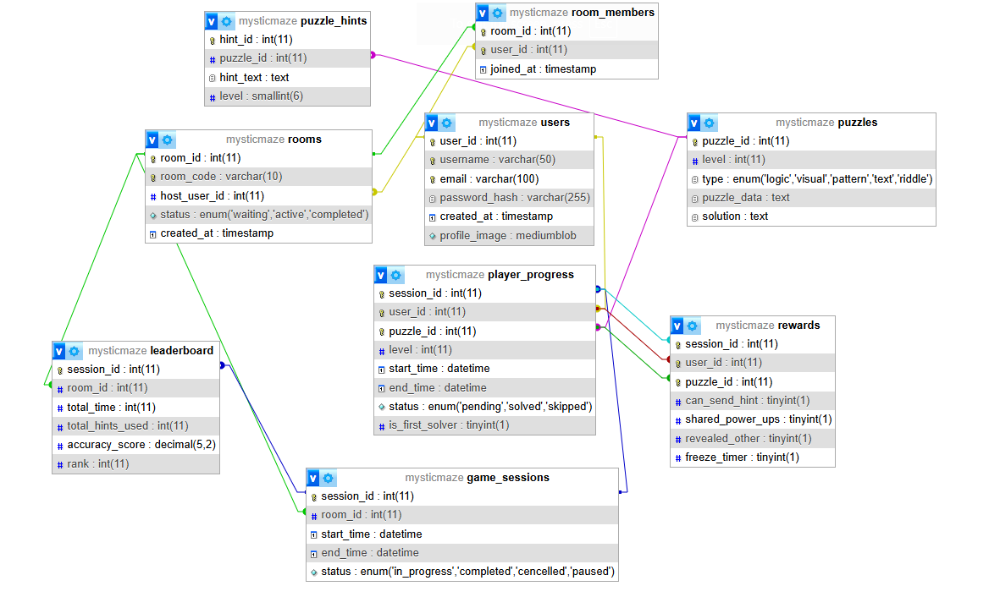

# Mystic Maze

Mystic Maze is a team-based 2D multiplayer puzzle-hunting game designed to engage players in completing levels filled with riddles, puzzles, and challenges. It offers teamwork-based gameplay with hints, leaderboards, and special powers.

## Features

### General
- Multiplayer team competition
- Player profile management

### Players
- Join/Host rooms
- Compete in puzzles and riddles
- Use special powers during challenges
- View rankings and leaderboard

### Admin/Moderators
- Manage rooms and players
- Monitor reports and feedback
- Manage puzzle levels

## Technologies Used

### Frontend
- JavaFX (with SceneBuilder)

### Backend
- Java (Socket Programming)
- MySQL (Database)

### Others
- XAMPP (Local Server for MySQL)
- IntelliJ IDEA

## Class Diagram

## System Diagram

## Setup Instructions

1. Clone the repository.
2. Import the project in IntelliJ IDEA.
3. Setup the MySQL database using provided SQL scripts.
4. Run the server.
5. Launch the client.

### Conclusion 

Mystic Maze aims to provide an engaging and interactive multiplayer experience where teamwork, problem-solving, and strategy come together in a dynamic 2D puzzle environment. This project showcases the integration of JavaFX, socket programming, and MySQL to create a seamless game experience while maintaining an efficient backend infrastructure.
Through this project, we also explored key aspects of multiplayer networking, real-time data synchronization, and user experience design

